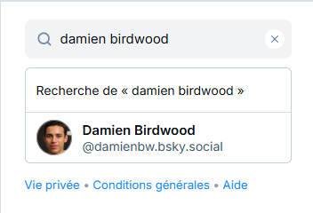
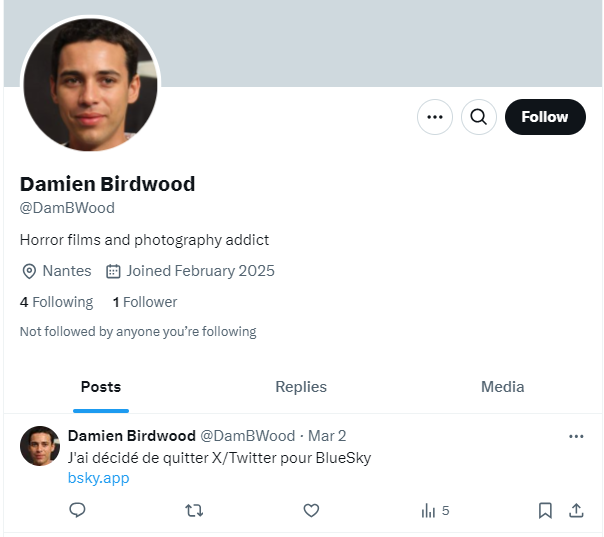

# Challenge
Trouvez Damien

## Enonce
Damien Birdwood a trouvé un film d'horreur en faisant le tri dans le grenier de son grand-père. Depuis, des choses étranges se sont déroulées, avant sa disparition. Sur quel réseau social Damien était-il actif ?

## Solution
Nous devons retrouver un réseau social sur lequel Damien est actif. Nous avons sa photo pour l'identifier.
Nous pouvons tenter une recherche sur un moteur de recherche comme Google. Apparemment, aucune trace de Damien. L'alternative est de rechercher manuellement sur les réseaux sociaux. Nous avons un résultat positif sur BlueSky (https://bsky.app/).
  

  
Nous avons également un résultat sur X/Twitter, mais le dernier post indique qu'il quitte Twitter pour Bluesky. Le flag est donc ENI{BLUESKY}.
  

  
## Hints