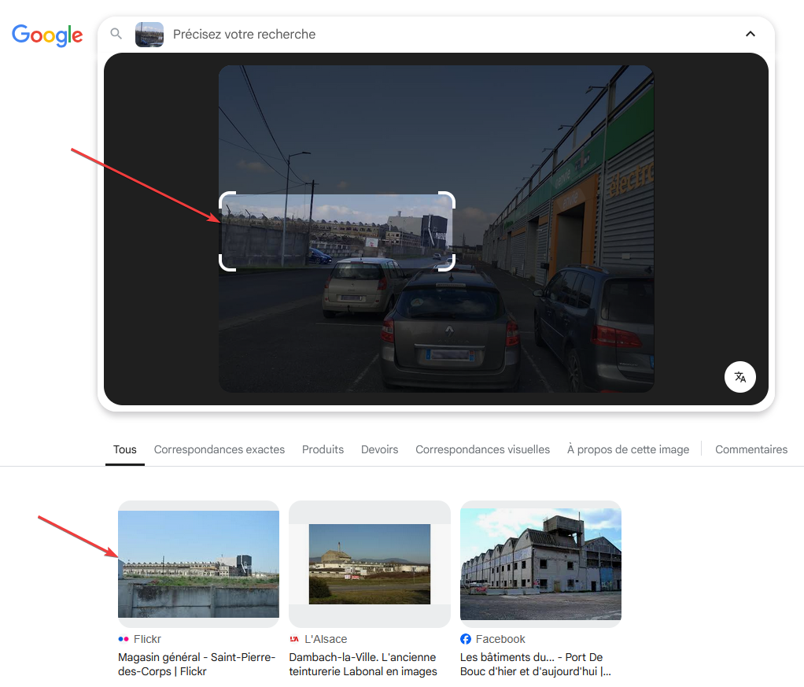
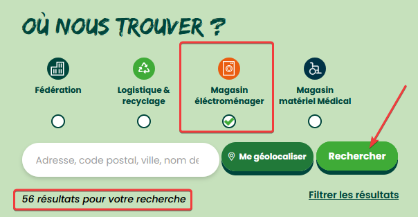
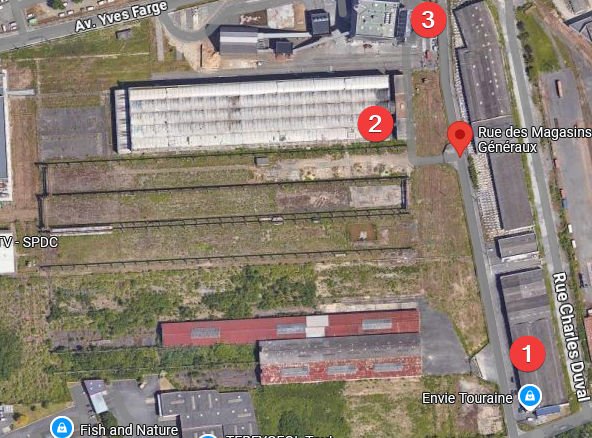
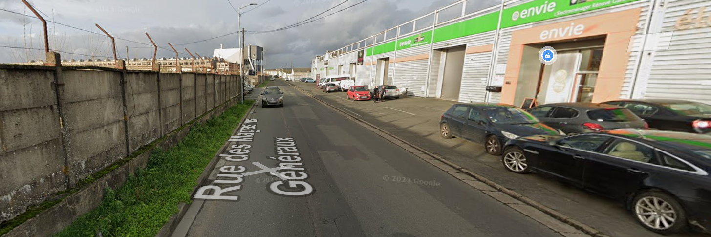
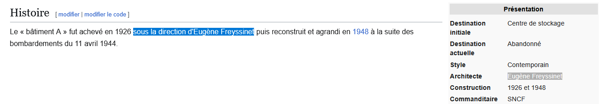
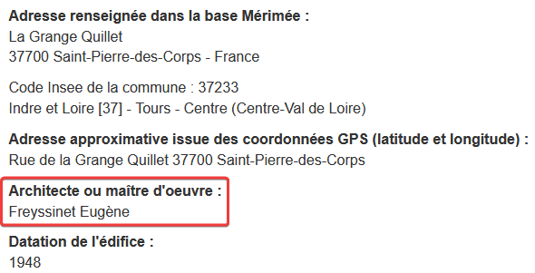
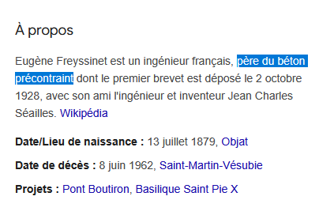
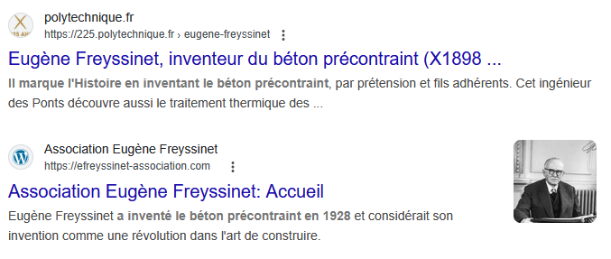

# Challenge
Les réseaux sociaux de Damien

## Enonce
Damien et son ami Simon sont amateurs d'urbex. Simon a mentionné un urbex effectué dans le passé avec Damien. Pour quelle invention l'ingénieur à l'origine de la construction de ce bâtiment abandonné est-il le plus connu ?

## Solution
L'énoncé nous parle d'un ami appelé Simon. En analysant le profil BlueSky de Damien, nous trouvons plusieurs interventions d'un certain Simon Dauvergeon, qui semble proche de Damien.

Sur le profil de Simon, nous trouvons en date du 06/03/2025 la mention d'un urbex effectué avec Damien. Ce post est accompagné d'une photo d'un vieux bâtiment, lieu de leur urbex.
Plusieurs informations doivent-être trouvées pour répondre à la question : 
- Où se situe ce lieu
- Quel est le nom de l'ingénieur à l'origine de sa construction
- Pour quelle invention cet ingénieur est connu

Analysons la photo : 
- Nous voyons au premier plan des voitures, donc une a une plaque minéralogique de l'Aude.
- Sur la droite, un magasin Envie.
- Au fond, le bâtiment abandonné, avec sur la clôture en béton un panneau portant le logo de la SNCF. Il semble donc que ce bâtiment ait appartenu à la société publique.
- Au fond, une usine récente.

Nous avons deux possibilités pour trouver le lieu : faire une recherche inversée de l'image, en espérant trouver un résultat, ou analyser les différents éléments repérés pour essayer de trouver le lieu.

* Solution 1 : 
Tentons sur Bing Images : aucun résultat. Essayons sur Google Lens. Une recherche sur l'ensemble de la photo ne donne rien. Si nous ciblons le bâtiment, nous avons un résultat : le magasin général à Saint Pierre des Corps, qui est le bon lieu.

* Solution 2 : 
Commençons par rechercher les magasins Envie en France. Sur le site de l'organisation (https://www.envie.org/), dans le menu Découvrir Envie, nous avons la cartographie du réseau. Sur la façade du magasin, nous voyons la mention "électroménager". Nous pouvons donc filtrer sur Magasin électoménager, puis lancer la recherche. Nous obtenons 56 magasins sur 110 au total.

En s'appuyant sur la plaque de la voiture, commençons par regarder du côté de l'Aude (Carcassonne). Nous voyons qu'il n'existe aucun magasin. Nous devons donc vérifier chaque magasin, un bouton S'y rendre permettant d'ouvrir Google Maps sur l'adresse du magasin. Avec le magasin de Saint Pierre des Corps, nous obtenons la vue satellite suivante : 1 Le magasin Envie, 2 le bâtiment abandonné, 3 l'usine à côté.
  

  
Une vue Streetview permet de confirmer le lieu.
  

  
Avec la recherche Google "saint pierre des corps rue des magasins généraux sncf", nous obtenons plusieurs résultats. Le premier résultat, Wikipedia, nous apprend que la personne à l'origine de la construction du bâtiment est Eugène Freyssinet. Un autre lien (https://monumentum.fr/architecture-contemporaine-remarquable/acr0000364/saint-pierre-des-corps-magasin-general-sncf) nous le confirme.

\

Recherchons sur un moteur de recherche des informations sur Eugène Freyssinet. Google nous donne directement l'information : Freyssinet est le père du béton précontraint. D'autres liens nous confirment l'information.

\

 Le flag est donc ENI{BETON_PRECONTRAINT}.

## Hints
