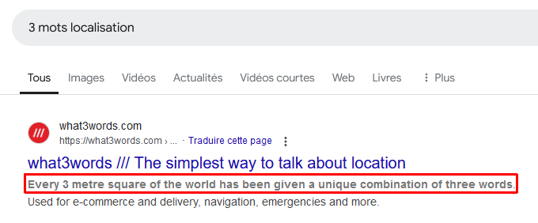
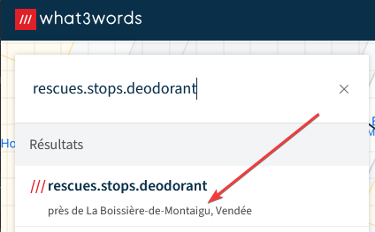

# Challenge
La journée de pêche

## Enonce
Simon a profité de l'ouverture de la pêche à la truite pour aller pêcher. Dans quelle ville sont-ils allé pêcher ?

## Solution
Sur le profil de Simon, nous voyons en date du 08/03/2025 qu'il a prévu d'aller pêcher avec son père le lendemain. Le lendemain, il poste un message étrange : "rescues.stops.deodorant". Cette information pourrait-elle nous apporter la réponse à la question ? Faisons une recherche pour vérifier. Sur Google (ou autre moteur de recherche), nous faisons la recherche sur les mots-clés "3 mots localisation". Le premier résultat nous indique que l'on peut localiser une localisation avec une combinaison de 3 mots, ce qui fait penser au message de Simon. 

Regardons de plus près ce résultat. Nous avons en haut à gauche un champ de saisie comportant une chaîne de caractère ressemblant au message. Saisissons les mots de Simon. Nous obtenons une localisation à proxmimité de La Boissière-de-Montaigu en Vendée.

Le flag est donc ENI{LA_BOISSIERE-DE-MONTAIGU}.

## Hints
