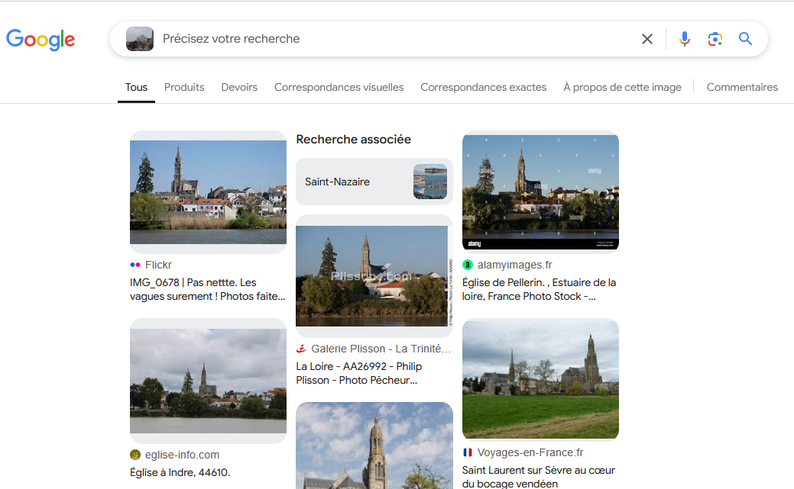
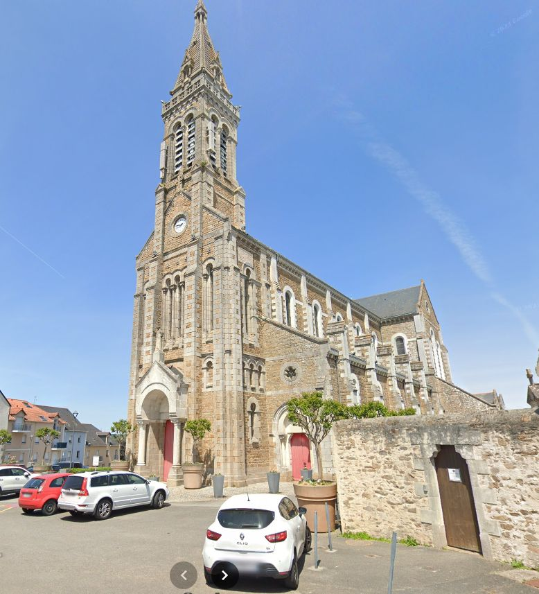
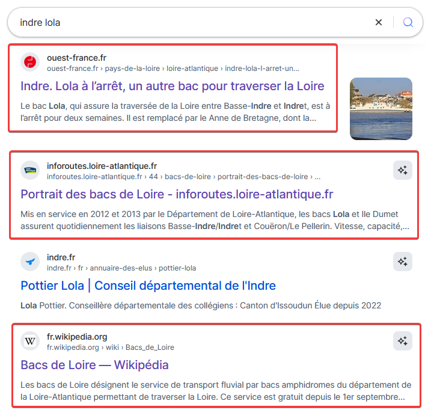
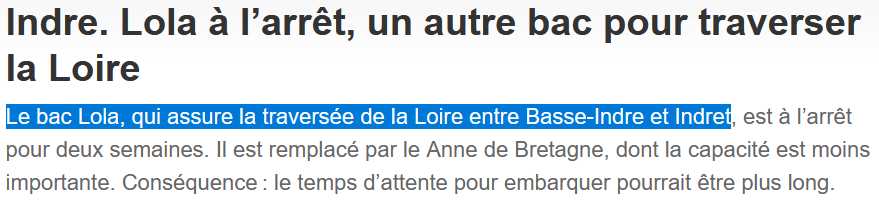
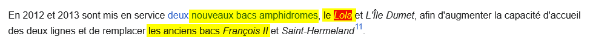
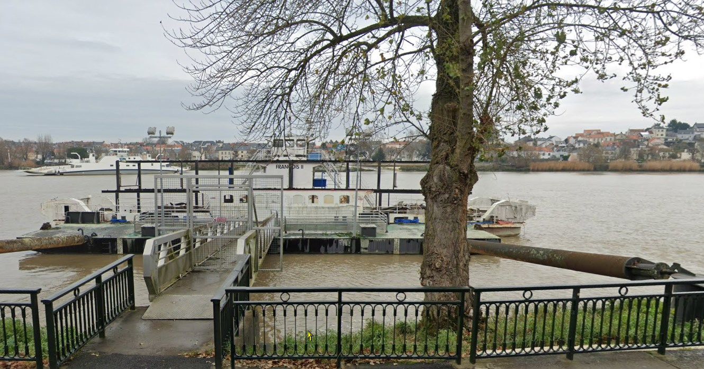
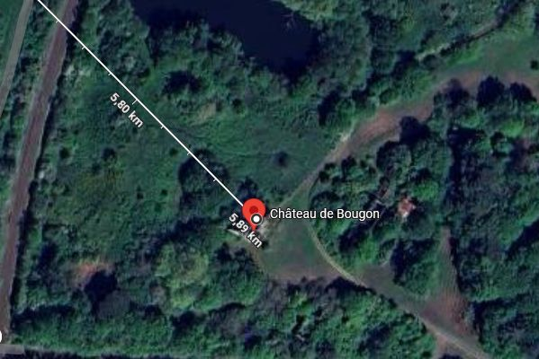

# Challenge
L'urbex de Damien

## Enonce
Damien est parti en urbex avec un autre urbexer. Une fois sur place, il a envoyé un message à Simon pour qu'il les rejoigne : "Simon, j'explore un lieu super. Rejoins-nous. Lola te mènera à François, tu trouveras le lieu à environ 6 km de là." \
En quelle année François a t'il cessé son activité ? \
Qui a racheté en 1864 le lieu exploré par Damien ?

## Solution
Le message de Damien est assez mystérieux. Il parle de Lola, de François et d'un lieu à 6 km. Une fois est également jointe. Commençons par elle. En faisant une recherche inversée sur Google Lens, nous trouvons plusieurs résultats : la première est indiquée à La Montagne (Couëron), une autre au Pellerin, une autre à Indre. Si on vérifie sur Maps, nous avons trois églises à Couëron (mais pas à La Montagne même), dont aucune ne correspond, une au Pellerin, en pierres blanches (ce qui n'est pas le cas de celle de la photo). La dernière, à Indre, correspond à notre église. Nous trouvons d'autres photos sur Wikipedia ([Page Wikipedia d'Indre](https://fr.wikipedia.org/wiki/Indre_(Loire-Atlantique)#.C3.89glise_Saint-Hermeland)), qui confirment qu'il s'agit de cette église.
  

 
  
Intéressons nous à Lola. Faisons une recherche sur un moteur de recherche. Que ce soir sur Google ou Qwant, les mots-clés "Lola Indre" nous donnent des résultats intéressants. Lola est le nom d'un bac faisant la liaison entre Indre (commune où se situe l'église en photo) et Indret.
  

  
 
  
Sur la [page Wikipedia traitant des bacs de Loire](https://fr.wikipedia.org/wiki/Bacs_de_Loire), nous avons également mention de Lola. Nous avons une autre information intéressante : un ancien bac s'appelle François II. 
  
 
  
En regardant plus intensément la page Wikipedia, nous apprenons que le François II a été mis en service en 1962 et remplacé en 2012 par Lola (nous avons la réponse à la première question). Si Lola nous mènera à François et qu'il fait la liaison entre Indre et Indret, jetons un oeil du côté d'Indret. Nous retrouvons le François II à quai. 
  
 
  
Le lieu d'exploration serait à environ 6 km du François II. En faisant une recherche des lieux d'urbex dans la Loire Atlantique, nous obtenons quelques résultats sur [Urbexe.com](https://www.urbexe.com/france/pays-de-la-loire/loire-atlantique/). Beaucoup sont trop loin. Nous avons un aéroport abandonné et un "château Bougon" à Bouguenais qui pourraient correspondre. En recherchant le château Bougon et en faisant une mesure, nous obtenons 5m89 depuis le quai du bac. 
  
 
  
Recherchons un peu d'information sur Château Bougon. En utilisant les mots-clés "chateau bougon histoire", nous trouvons plusieurs résultats nous apprenant que le propriétaire à la fin du 19è siècle était Paul Renaud. 
  
 
  
Le flag est donc ENI{2012_PAUL-RENAUD}. 

## Hints
