# Challenge
La fin

## Enonce
Avec qui Damien a t'il fait l'exploration (identité complète) ?

## Solution
Nous connaissons de Damien son compte BlueSky et son compte sur journalintime.com. En date du 11 mars 2025, nous pouvons lire sur son compte journalintime.com un message concernant un urbex. Il y indique qu'il va prochainement partir explorer un ancien château avec un autre urbexer. En bas du message, nous voyons un hashtag énigmatique : #EML.

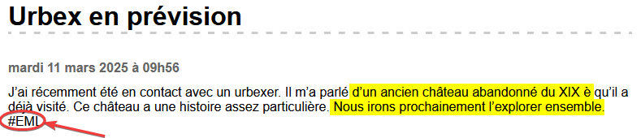

En regardant ses relations sur Bluesky, nous voyons qu'il suit un certain Enzo Lemoine, fan d'urbex également. Sur son profil, il a posté le 13 mars un message disant qu'il partirait le lendemain en urbex avec un ami : cela colle avec ce le message de Damien. Le hashtag trouvé précédemment pourrait correspondre à ses initiales. Mais il manque une partie de son nom.

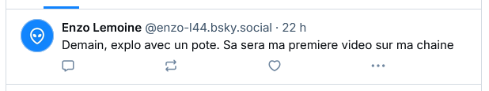 \
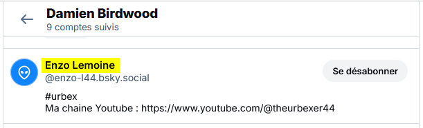

Enzo mentionne sa chaîne Youtube. Allons y jeter un oeil. Pas grand chose à y voir. Jetons un oeil sur le site [Unlistedvideos](https://unliste573777dvideos.com). Il permet d'indexer des vidéos qui ne sont pas affichées publiquement sur une chaîne Youtube. En cherchant sur le nom de la chaîne (The Urbexer), nous trouvons un résultat.

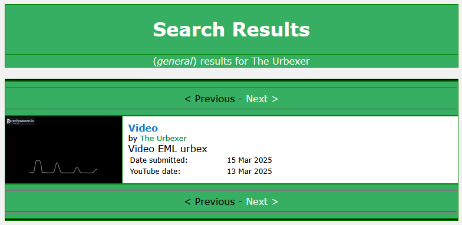

Les URL des vidéos Youtube comportant un identifiant sous forme d'une chaîne de caractères, essayons pour voir ce que ça donne. L'URL https://www.youtube.com/watch?v=yl3xchjLDQY nous mène à une vidéo du même compte. Cette vidéo laisse entendre des bips. Cela pourrait ressembler à du morse. Téléchargeons la vidéo en MP3, de nombreux sites le permettent gratuitement (nous utilisons https://notube.lol/fr/). Ouvrons maintenant le fichier son dans Audacity : si nous considérons que les bandes courtes représentent les points et les longues les traits, nous obtenons `- ...-- .-. .-.. --. ---.. --- -.-- .- ..--- --... --... .---- .--`. 

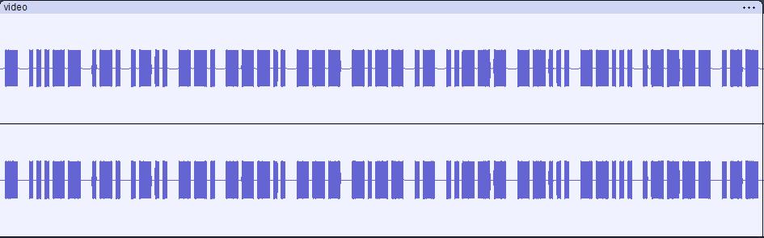

Le site [Lexilogos](https://www.lexilogos.com/clavier/morse.htm) propose un convertisseur morse en ligne. Il nous donne le résultat suivant : T3RLG8OYA2771W. 
Si nous retournons à la vidéo Youtube, nous remarquons que la description comporte deux chaînes de caractères ressemblant à des hashes.

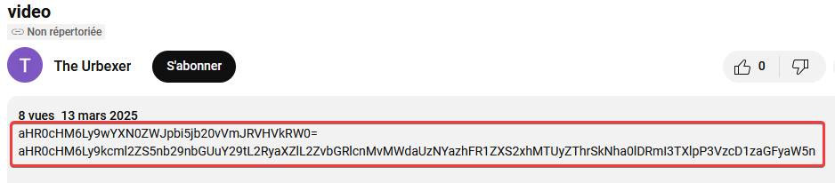

Le site [Hashes.com](https://hashes.com/en/tools/hash_identifier) permet d'identifier le type de hash et de le déchiffrer : les deux chaînes sont en base64. La première chaîne correspond à l'url https://pastebin.com/VbQTudEm, la seconde à l'URL https://drive.google.com/drive/folders/1gZS3Xk8EGVWKla152e8kJCakICFb7Myi?usp=sharing.

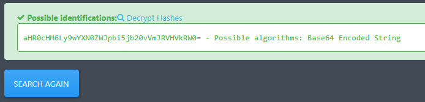

Si nous visitons le lien Pastebin, nous devons saisir un mot de passe pour accéder au contenu. Tentons la chaîne trouvée en morse. Le code morse ne distingant pas la casse, nous allons la tenter en majuscules et minuscules. Cela passe en minuscules. Nous obtenons une nouvelle chaîne de caractères, qui est également en base64. Nous obtenons cette fois un lien Swisstransfer.

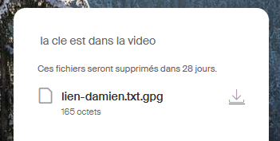

Téléchargeons le fichier. Il porte l'extensions .gpg, il est probablement chiffré. La commande `file` sur Linux nous le confirme. Nous allons avoir besoin d'une clé pour le déchiffrer.
Regardons maintenant le lien Google Drive trouvé tout à l'heure. Nous trouvons un fichier JPG représentant la Joconde.  

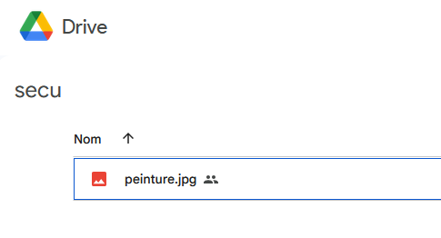

Il n'y a rien de visible. Les données EXIF ne nous apportent rien. Tentons [Aperisolve](https://www.aperisolve.com). Steghide nous indiqué la présence d'un fichier.

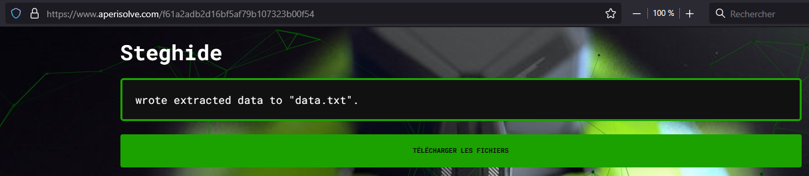

La commande `steghide info peinture.jpg` nous le confirme. Tentons de l'extraire avec la commande `steghide extract -sf peinture.jpg`.

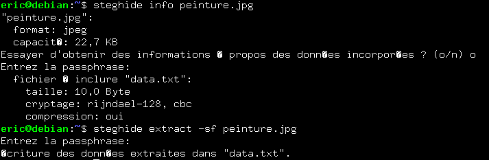

Le fichier n'est pas protégé par une passphrase. Le fichier extrait contient une nouvelle chaîne de caractères.

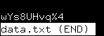

Serait-ce le mot de passe manquant pour déchiffrer le fichier .gpg ? Tentons avec la commande `gpg -o decrypte.txt -d lien-damien.txt.gpg`. Le fichier déchiffré contient un lien Google Drive.

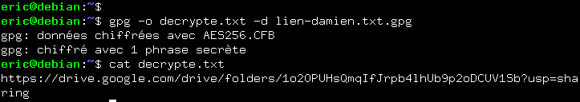 \
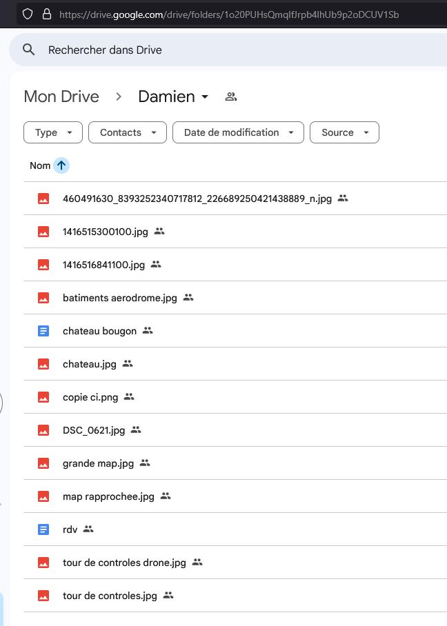

Nous pouvons voir plusieurs photos JPG, ainsi que deux documents Google Docs. L'un comporte des informations sur Château Bougon, qui ne nous sont utiles actuellement. Le second contient la ligne suivante : `rdv à civisme.relier.donneuse a 22h`. La chaîne What3word nous mène près du port de départ du bac, à Indre, information que nous avons déjà. Ils avaient rendez vous à 22h. Si nous regardons les photos, nous voyons différentes photos du château et de l'ancien aérodrome à proximité. Une photo nous montre la carte d'identité d'Enzo, qui révèle (enfin) son identité complète : Enzo Mancini Lemoine.

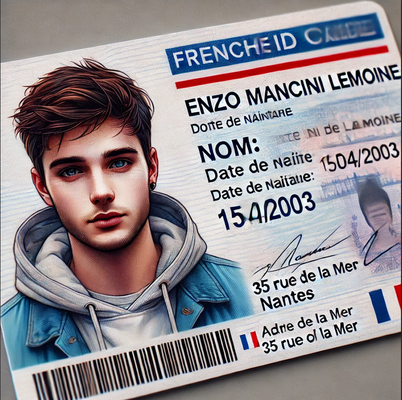

## Hints
