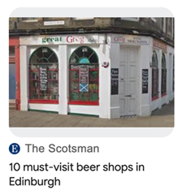
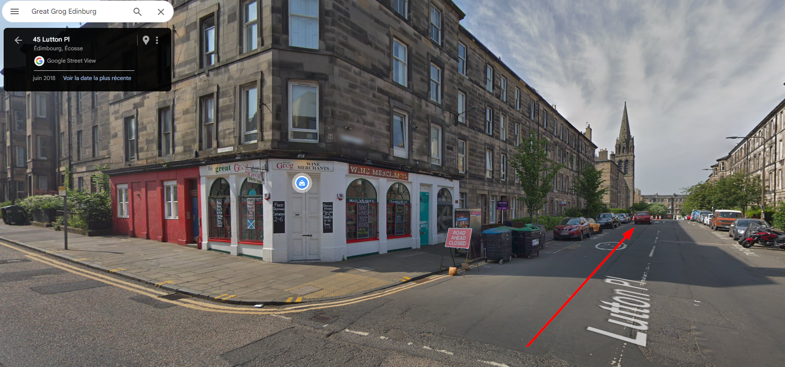
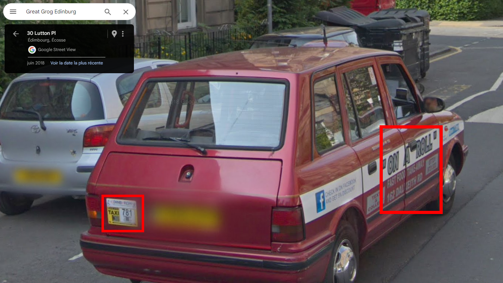
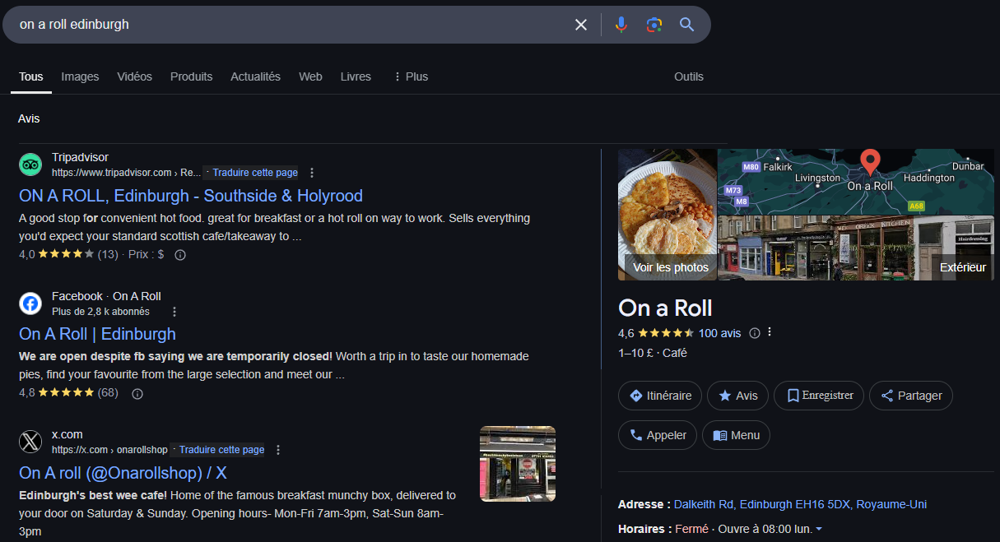
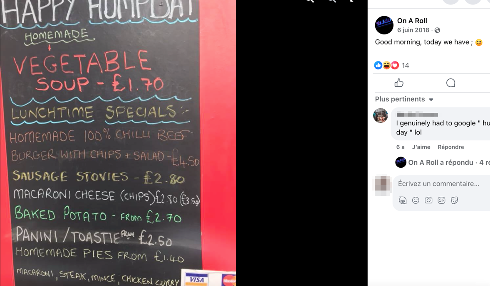

# Challenge
Sarah

## Enonce
Le 6 Juin 2018 à 11h30, Sarah se rend au Great Grog achète une bouteille de vin, puis appelle un Taxi. Quelques minutes plus tard, le Taxi n°781 la récupère dans une rue attenante. Elle se rend à l’adresse indiqué sur ce dernier pour déjeuner. Ce jour-là, après avoir réglé le taxi elle ne possède plus que 2 £ de monnaie en poche.

Mort dans des circonstances étranges, les enquêteurs ont retrouvé un briquet, des clés et 0,30 £ de monnaie sur la victime.

## Solution

Une rapide recherche Google permet de trouver l'adresse d'un bar nommé Great Grog Newington à Edimbourg (en Ecosse). La devanture colle en tout point.

Nous savons que Sarah s'est rendu à l'adresse indiqué sur un taxi numéroté 781 en sortant du bar.

Une recherche depuis Google Street View, en prenant soin de selectionnée l'année 2018, nous permet de retrouver un taxi ayant ce meme numéro auprès du bar.

Sur le taxi nous pouvons également lire une publicité pour un Fast-Food nommé le "On a Roll".

Une seconde recherche Google nous permet d'indentifier plus précisement ce restaurant:

Nous pouvons constater que les informations de ce restaurant sont consutable depuis leur page Facebook.

En remontant les posts jusqu'a la date de ce drame, il est possible d'observer une publication affichant la carte de jour :

Un rapide calcul nous permet de resoudre ce challenge : ENI{VEGETABLE_SOUP}

## Hints
- Google Street View
