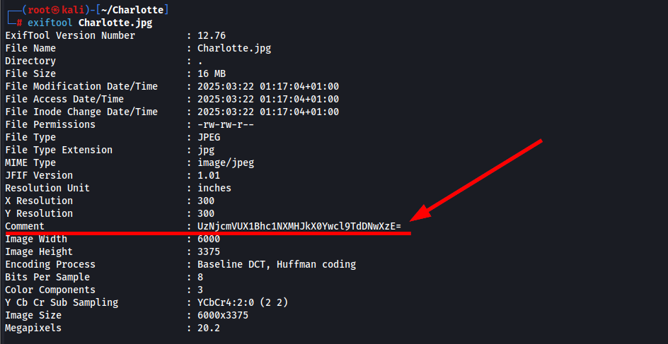
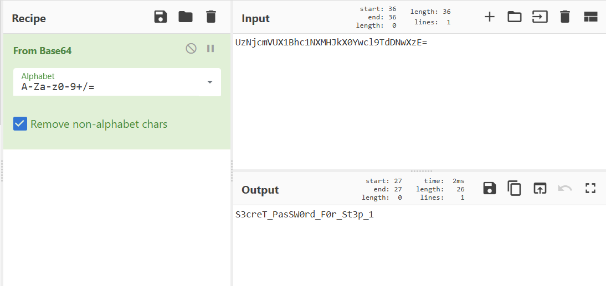
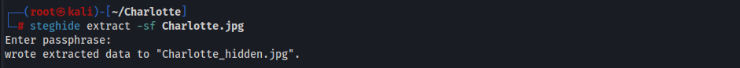
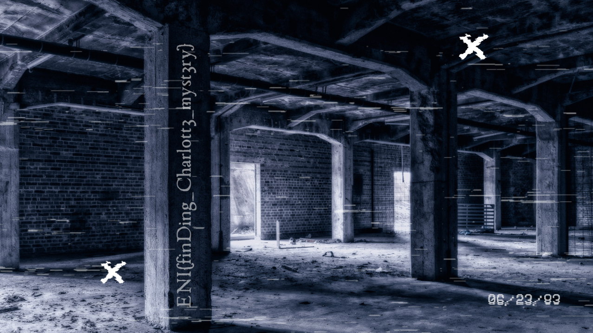

# Challenge
Charlotte

## Enonce
Charlotte, une fille au passé trouble, semble avoir disparu. La seule chose qu'elle ait laissée derrière elle est ce fichier. Peut-être contient-il des informations intéressantes !

## Solution
En analysant les metadonnées de l'image `Charlotte.jpg` on observe que la valeur `Comment` (lié aux commentaires) est rempli. De plus cela ressemble à du Base64.

En passant la chaine de caractère dans le fameux outils CyberChef, nous retrouvons un mot de passe.

Cela semble ensuite evident que l'on va devoir réutiliser ce mot de passe pour l'étape suivante. Peut-etre que l'outil `steghide` pourra nous être utile :

En effet, l'utilisation du mot de passe a permis la récupération d'un fichier `Charlotte_hidden.jpg`, qui était caché au sein de `Charlotte.jpg`.
En ouvrant ce nouveau fichier nous récupérons le flag de ce challenge :

## Hints
- Vous aurez besoin de trouver un mot de passe caché
