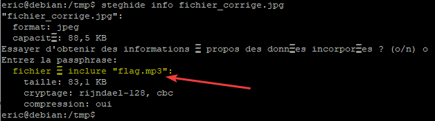

# Challenge
Mais quel est ce fichier ?

## Enonce
Trouvez les mots du flag !

## Solution
Nous avons un fichier data.zip. Si nous le décompressons, nous obtenons un fichier data, sans plus d'information. Ouvrons-le avec un éditeur hexadécimal pour en savoir plus. Nous voyons la mention JFIF au début du fichier, qui indique qu'il s'agit d'un fichier JPEG.

Renommons-le avec l'extension .jpg. Malheureusement, le fichier ne s'ouvre pas. Intéressons-nous à la manière dont une image JPEG est constituée. Nous recherchons "Magic number jpeg". Deux sites vous nous intéresser : https://gist.github.com/leommoore/f9e57ba2aa4bf197ebc5 et https://en.wikipedia.org/wiki/List_of_file_signatures. Nous pouvons y avoir que le Magic number pour les fichiers JPEG est ff d8 ff e0. Le magic number correspond aux premiers octets d'un fichier, qui indiquent le format. \
Pour notre fichier, nous voyons que l'hexadécimal commence par e0 00. Il est probable qu'il est été modifié. Ajoutons les trois octets manquants, à savoir ff d8 ff.

Enregistrons ensuite le fichier avec l'extension .jpg. Le fichier s'ouvre désormais, montrant un paysage. \
Vérifions désormais les métadonnées. Exiftool ne nous montre pas grand chose d'intéressant.

Essayons avec Steghide. Nous voyons la présence d'un fichier flag.mp3. Extrayons-le, toujours avec steghide.
  
 \

  
Nous obtenons un fichier MP3. Inspectons-le. Aucun tag n'est présent dans le fichier. Ecoutons-le. Nous entendons un bruit étrange. Inspectons-le avec Audacity. Rien de particulier. Affichons le spectrogramme. Et là, surprise ! Il est également possible d'utiliser [dcode](https://www.dcode.fr/analyse-spectrale).
  

  
Un message apparaît : "Carnaval de Venise".

 Le flag est donc ENI{CARNAVAL_DE_VENISE}.

## Hints
