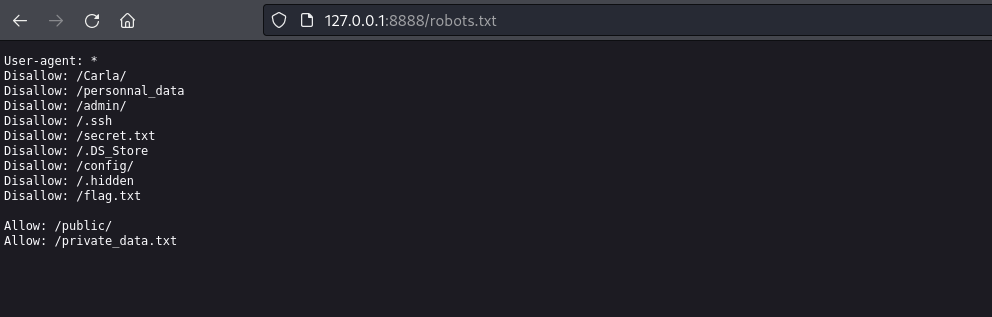
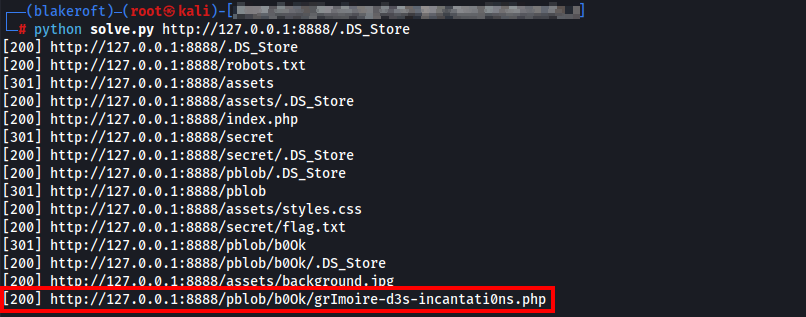
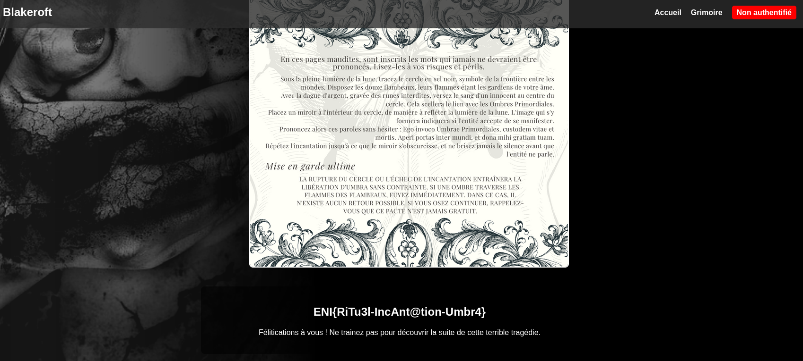

# Challenge
Blakeroft (1/3)

## Enonce
La petite ville de Blakeroft est chargée d'histoire. On y raconte que des choses terribles s'y sont produites il y a plusieurs dizaines d'années. Un père aurait invoqué une entité dans l'objectif d'améliorer l'état de santé de sa fille. L'expérience aurait touné au drame. En tant qu'enquêteur chevronné sur ces sujets, vous êtes de vous y rendre et d'en savoir davantage.
    
Dans cette première phase, vous serez chargé de découvrir le grimoire utilisé pour invoqué l'entité.
    
PS: Aucun FUZZ / Brute-force n'est nécessaire.

## Solution
Sur la page d'accueil on peut observer que le lien vers la page du grimoire n'est pas fonctionnel.

En creusant un petit peu, nous pouvons identifier la présence d'un fichier `robots.txt` :

Parmi les repertoires / pages listées, il est possible d'observer que l'acès au fichier .DS_Store télécharge un fichier.

En regardant à quoi correspond ce fichier depuis un moteur de recherche, il semblerait que ce fichier puisse contenir des informations interressantes sur les dossiers système MacOS.

Sa lecture étant difficile au travers d'outils tel que `cat` ou `strings`, une nouvelle recherche permet d'identifier des script permettant d'exploiter ce genre de fichier : [Lien GitHub](https://github.com/lijiejie/ds_store_exp/blob/master/ds_store_exp.py)

Son utilisation va donc nous permettre d'identifier les fichiers présents sur le serveur, mais également de les télécharger si nous souhaitons garder quelques traces.

Son execution nous permt de récupérer les résultats suivants :

Nous venons d'obtenir un fichier présent sur le serveur, et qui n'était pas référencé.

Son accès nous permet alors de récupérer le grimoire, ainsi que le flag.

## Hints
- Avez-vous regardé du côté des robots ?
