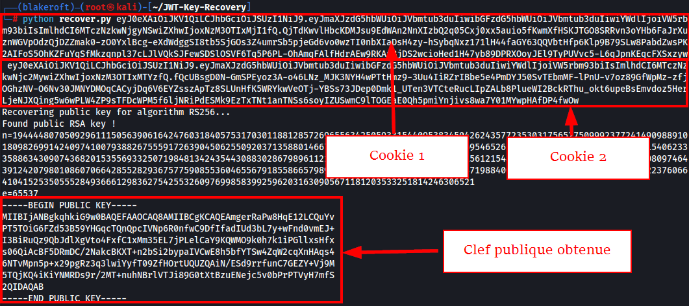

# Challenge
Blakeroft (2/3)

## Enonce
Maintenant que l'on a une piste sur l'entité invoquée, il est necessaire de s'informer sur cette dernière.
    
PS: Aucun FUZZ / Brute-force n'est nécessaire.

## Solution
Sur la page d'accueil nous pouvons observer une nouvelle fonctionnalité (Umbra.php). De plus, il semble qu'il y ai un contrêle d'utilisateur authentifié / non authentifié.

Il est possible de constater qu'un cookie de session `auth_token` nous est attribué lors de la consultation de cette application Web :

Le format commençant par `ey`, tout semble à croire qu'il s'agit d'un format JWT.

Nous pouvons voir que le cookie contient des données tel que `firstname`, `lastname`, `age`. De plus, ce cookie est signé avec l'algorithme RS256.
Un tour sur le site de PortSwigger Academy permets de découvrir qu'une vulnérabilité `Algorithm Confusion` peut être exploitée dans certains cas de figure : [Lien PortSwigger](hhttps://portswigger.net/web-security/jwt/algorithm-confusion)

Pour se faire, il est nécessaire d'avoir en sa possession 2 cookies de session pour ensuite tenter d'obtenir la clef publique.

Dans cet exemple l'outil JWT-Key-Recovery est utilisé.

Maintenant que l'on a une clef publique, nous pouvons tenter de modifier les valeurs puis de signer le nouveau cookie en HMAC avec la clef publique précédemment obtenue.

Sur la page Umbra.php, nous pouvons nous souvenir qu'il était inscrit que seul les membres de la famille Dreadmoor pouvaient accéder à son contenu. Nous allons modifier le cookie en ce sens.

Nous pouvons ensuite contrôler notre nouveau cookie.

La modification du cookie de session par ce dernier permet ensuite d'afficher le contenu de la page, dont le flag.

## Hints
- Aimez-vous les cookies ?
- Vous semblez être dans un état 'confus'
