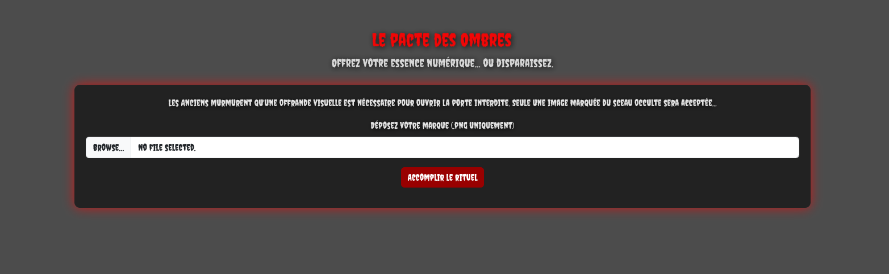
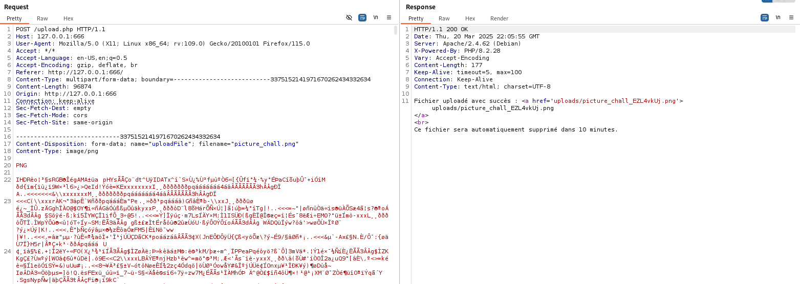
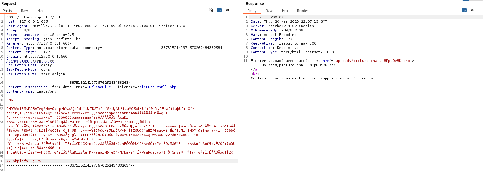
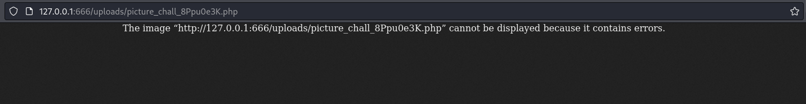
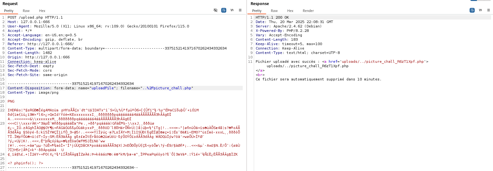
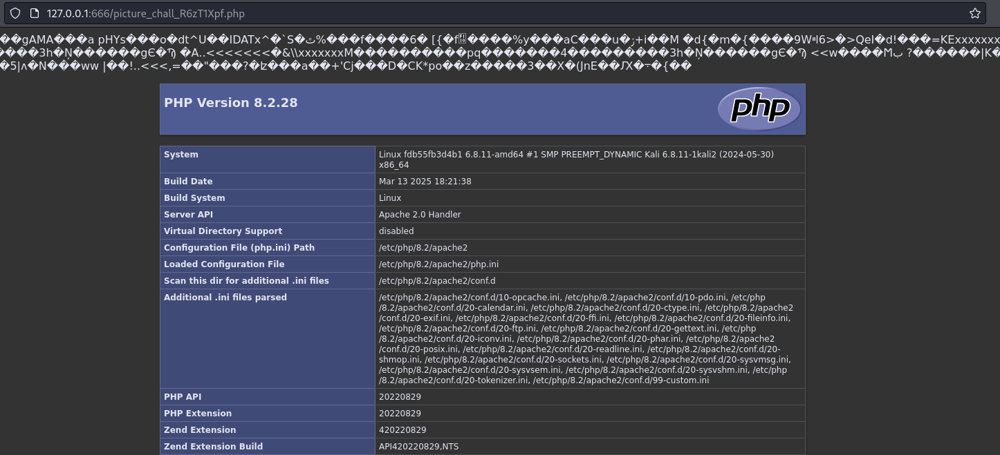
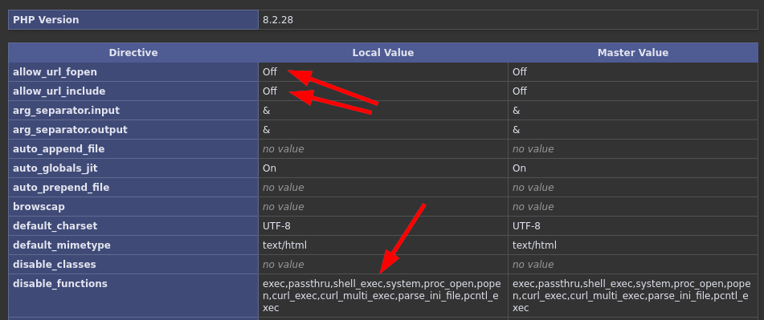
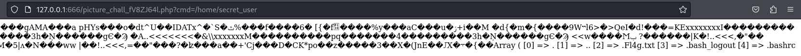
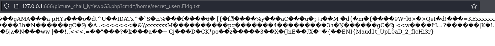

# Challenge
Le Pacte des ombres

## Enonce

    
PS: Aucun FUZZ / Brute-force n'est nécessaire.

## Solution
Sur la page d'accueil nous pouvons observer une fonctionnalité d'upload de fichier.
On est invité à envoyé un fichier au format PNG

Lors de la transmission d'un fichier légitime, nous pouvons récupérer en réponse le chemin dans lequel est stocké l'image.

Lorsque nous tentons d'effectuer un envoi de fichier PHP simple, une erreur est retourné, nous indiquant que le format de fichier doit etre PNG (comprendre MIME).

En interceptant alors l'envoi d'un véritable fichier PNG légitime sur lequel nous allons, via Burp, injecter du code php et ensuite modifier l'extension en .php, il est possible de constater que le serveur accepte le fichier.

Malgré tout le fichier ne semble pas executable lors nous souhaitons y accéder. Cela laisse alors penser que le repertoire `uploads` ne permet pas l'execution de code PHP.

Il est alors necessaire de trouver une solution, dans ce cas la solution était d'effectuer une attaque Path Transversal durant l'upload de fichier.

En accédant de nouveau au répertoire de telechargement, nous pouvons constater que le code PHP à pu être executé.

Il est possible de constater qu'un grand nombre de fonctions ont été désactivées, limitant grandement les actions pouvant être effectuées par les utilisateurs malveillants.
Il est néanmoins possible de constater que les fonctions `scandir` et `file_get_contents` ne sont pas désactivées.

L'exploitation de la fonction `scandir` permet de découvrir un repertoire `secret_user` au sein de `home`.
En creusant davantage nous pouvons découvrir à l'intérieur un fichier caché `.Fl4g.txt`.

L'utilisation de la fonction `file_get_contents` nous permet ensuite de récupérer le Flag.

## Hints
- Connaissez vous Marcel Marceau ?
- Il va falloir traverser !!
- Trouvez les bonnes fonctions
